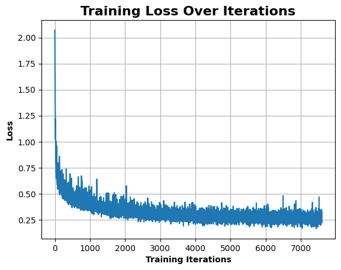
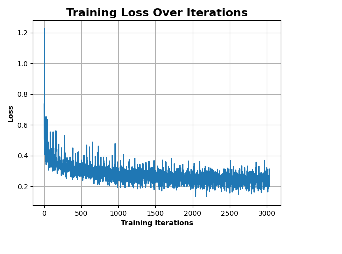
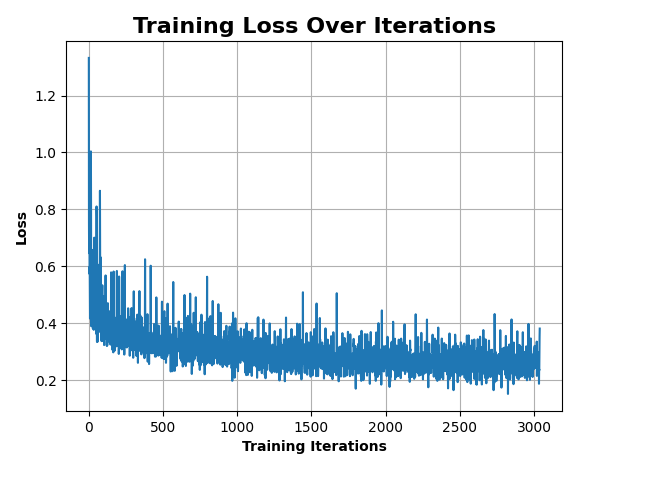
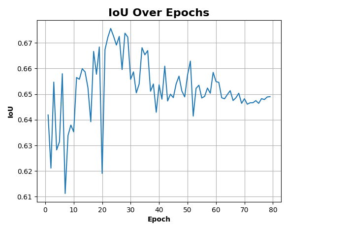
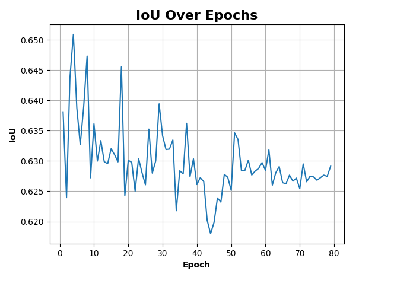
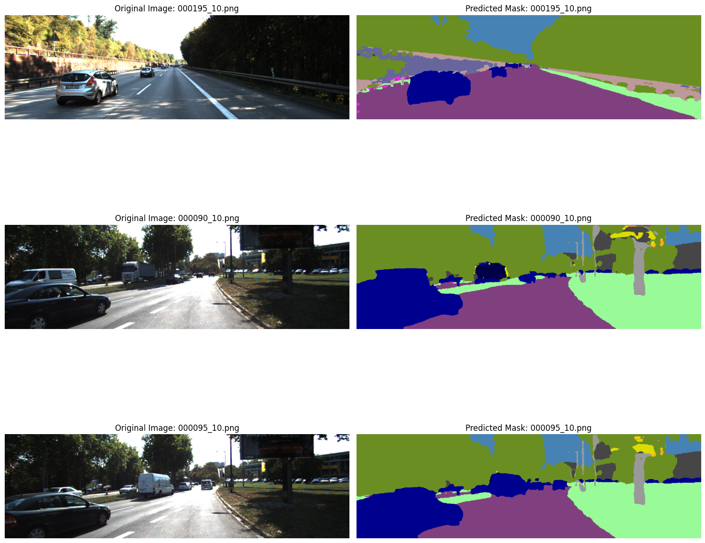
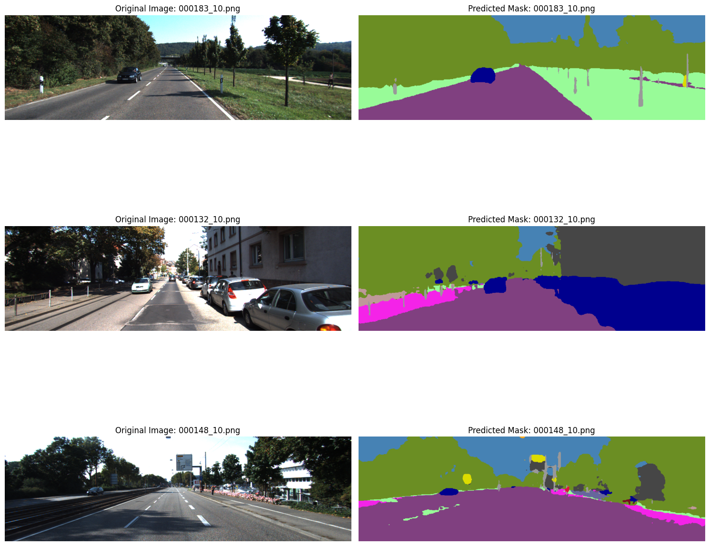
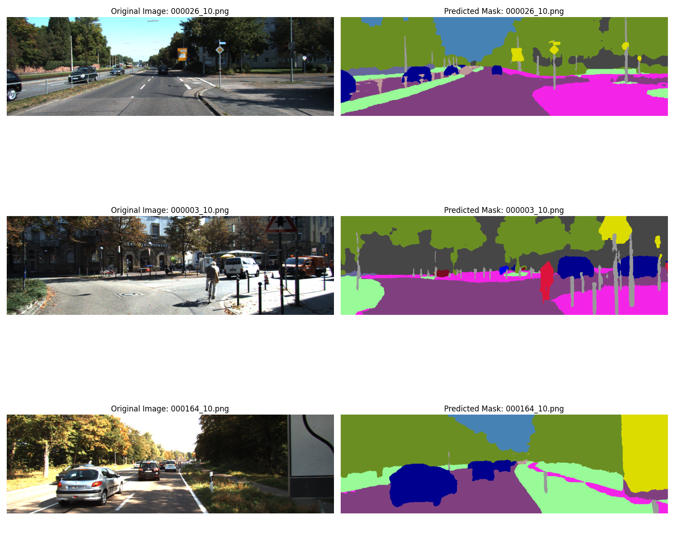
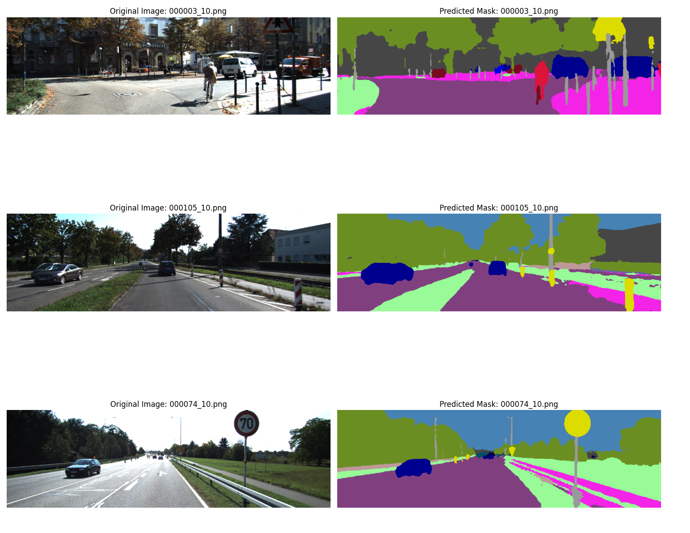

# Road Segmentation Challenge

## 🧭 Overview

This repository contains the submission for **Assignment 4** of the Computer Vision course. This assignment is structured as a **practical competition**, where students are required to improve a baseline semantic segmentation model to achieve the best possible trade-off between **accuracy** and **computational efficiency** on a **road segmentation** dataset.

---

## 📝 Task Description

I chose **Competition 3: Road Segmentation**, which involves:

- **Dataset**: 150 training images, each sized approximately 800 × 256 pixels.
- **Classes**: 19 semantic classes.
- **Objective**: Improve the performance of a baseline convolutional neural network (CNN) on this dataset.

---

## 🧱 Baseline Summary

The baseline model provided includes the following components:

- Data loading and preprocessing using `torchvision`.
- Basic data augmentation strategies.
- A simple CNN architecture.
- Cross-entropy loss function.
- Training and evaluation routines.
- Output predictions for visual inspection.

---

## 🚀 Our Improvements

I introduced several changes to enhance both **accuracy** and **efficiency**:

### Model & Training Enhancements

- Replaced baseline CNN with a lightweight **U-Net** variant.
- Integrated **Batch Normalisation**, **Dropout**, and **Residual** layers.
- Applied a **pretrained encoder** (*Transfer Learning from Cityscapes Dataset*).
- Switched optimiser from SGD to **AdamW**, with a **cyclical learning rate**.
- Created a hybrid **Cross-Entropy + Dice Loss** function for improved performance.

### Data Augmentation

- Added transformations such as:
  - **Random Horizontal Flip**
  - **Color Jitter**
  - **Random Crop/Resize**

### Efficiency-Oriented Modifications

- Pruned redundant layers from the model.
- Measured model complexity (GFLOPs) using `ptflops`.
- Carefully balanced accuracy and efficiency for a better **accuracy-to-FLOP ratio**.

---

### SegFormer with EfficientNet-B3 Backbone

Later, I extended our experiments to include a more advanced model architecture. I integrated a prebuilt **SegFormer** implementation using **EfficientNet-B3** as the encoder. This model was **pretrained on ImageNet**, providing strong feature extraction from the start. While significantly more computationally expensive, it yielded:

- Improved segmentation accuracy  
- Smoother mask outputs  
- Faster convergence during training  

This model served as a valuable performance benchmark and helped validate that our lightweight U-Net trade-off was effective for constrained settings.

I also experimented with **SegFormer B2**, which provided a strong balance of improvement over the baseline in both **accuracy** and **efficiency**.

---

## 📊 Visual Results

To evaluate model behavior, I tracked training and validation metrics over time and inspected segmentation outputs.

### Training Curves

| SegFormer – EfficientNet B3        | SegFormer – MiT B3                | SegFormer – MiT B2                |
|-----------------------------------|-----------------------------------|-----------------------------------|
|  |  |  |
|  |  |  |

These plots show **rapid convergence** and **improved generalisation**, demonstrating the benefits of transfer learning from large-scale datasets like ImageNet.

---

### Segmentation Output Examples

Below are sample predictions from the **SegFormer** models, compared to the U-Net variant. The SegFormer outputs display **sharper boundaries** and better **semantic consistency**.

| U-Net Prediction                 | SegFormer – EfficientNet B3       | SegFormer – MiT-B3                | SegFormer – MiT-B2                |
|----------------------------------|-----------------------------------|-----------------------------------|-----------------------------------|
|  |  |  |  |

> *The SegFormer model was notably better at preserving boundaries and identifying small road segments — especially in cluttered or occluded scenes.*

---

## 📈 Results Summary

| Metric                        | Value     |
|------------------------------|-----------|
| **Baseline Accuracy**         | 28.00%    |
| **Improved Accuracy**         | 65.09%    |
| **Baseline GFLOPs**           | 66.97     |
| **Improved Model GFLOPs**     | 50.50     |
| **Efficiency (Acc / GFLOPs)** | 1.29 (% per GFLOP) |

> *Detailed results, analysis, and limitations are documented in the accompanying report.*

---

## 📦 Submission Contents

- `Road_Segmentation.ipynb`  
  → Modified Jupyter notebook with structured analysis of models and design decisions. The final chosen model (**SegFormer MiT-B2**) is loaded and evaluated.

- `Road_Segmentation.pdf`  
  → PDF version of the final notebook for offline viewing.

- `Pre_Training_Model.py`  
  → Script to load, train, test, and save weights for the U-Net model on the Cityscapes dataset.

- `models/`  
  → Folder containing model architecture files and training visualisation results.

- `resources/`  
  → Includes the original baseline model, documentation, and competition rules.

- `requirements.txt`  
  → List of libraries required to reproduce the results.

---

## 📊 Evaluation Breakdown

| Component               | Weight     |
|-------------------------|------------|
| Accuracy Improvement    | 10 marks   |
| Efficiency (Acc/GFLOPs) | 10 marks   |
| Report                  | 30 marks   |

---

## 🧪 Technologies Used

- Python  
- PyTorch  
- NumPy  
- OpenCV (image preprocessing)  
- `torchvision`, `albumentations` (augmentations)  
- `ptflops` (model complexity analysis)

---

## 👥 Authors

- **Maxwell Busato**  

---
